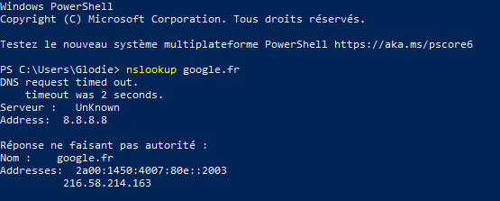

### Exercice 4 : DNS

**Seul**

1. Toujours sur le même dépôt
2. Créez une nouvelle branche nommée `feature/exercice4` à partir de la branche principale `main` 
3. Créez un nouveau fichier `ip.md`
4. Trouvez les adresses IP associées aux noms de domaine (nom d'hôte) suivants et les noter dans le fichier `ip.md`:

- www.google.fr
- www.google.com
- www.m2i.fr
- www.amazon.fr
- www.facebook.fr
- www.msn.com
- www.orange.fr
- www.app.diagrams.net
- www.lequipe.fr

5. Commitez votre travail sur la branche précédemment créée

#### Aide pour trouver une IP à partir du nom d'hôte

Pour trouver l'adresse IP associé à un nom de domaine, vous pouvez utiliser la commande suivante à partir d'un terminal
`nslookup domain.com`
